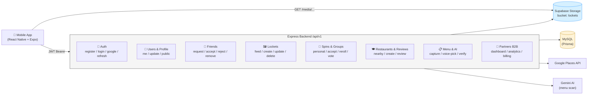

# API Reference — Food Roulette Backend

> Danh sách toàn bộ API của backend Food Roulette.
> **Base URL:** `/api/v1` · **Auth:** JWT Bearer token (header `Authorization: Bearer <token>`)
> Middleware: `authenticateJWT` / `requireJWT` (bắt buộc), `optionalJWT` / `optionalAuth` (tùy chọn), `authenticate` (yêu cầu).

> 📊 **Xem thêm:** [Class Diagram & Sequence Diagram](architecture-diagrams.md)

## Tổng quan kiến trúc

---

## 1. Auth — `/api/v1/auth`

| Method | Path | Auth | Mô tả |
|--------|------|------|-------|
| POST | `/api/v1/auth/register` | — | Đăng ký email/password |
| POST | `/api/v1/auth/login` | — | Đăng nhập |
| GET | `/api/v1/auth/me` | JWT | Thông tin user hiện tại |
| POST | `/api/v1/auth/google` | — | Google OAuth |
| POST | `/api/v1/auth/onboarding` | JWT | Hoàn tất onboarding (preferences) |
| POST | `/api/v1/auth/forgot-password` | — | Gửi email reset password |
| POST | `/api/v1/auth/reset-password` | — | Reset password |
| POST | `/api/v1/auth/refresh` | — | Refresh access token |

---

## 2. Users — `/api/v1/users` (và `/api/v1/profiles`)

| Method | Path | Auth | Mô tả |
|--------|------|------|-------|
| GET | `/api/v1/users/me` | JWT | Profile hiện tại |
| PATCH | `/api/v1/users/me` | JWT | Cập nhật profile |
| GET | `/api/v1/users/:publicId` | optional | Xem profile công khai |

---

## 3. Profile — `/api/v1/profile`

| Method | Path | Auth | Mô tả |
|--------|------|------|-------|
| GET | `/api/v1/profile/me` | JWT | Profile hiện tại |
| PATCH | `/api/v1/profile/` | JWT | Cập nhật profile |
| GET | `/api/v1/profile/preferences` | JWT | Đọc preferences |
| PUT | `/api/v1/profile/preferences` | JWT | Cập nhật preferences |
| POST | `/api/v1/profile/onboard` | JWT | Hoàn tất onboarding |
| GET | `/api/v1/profile/:publicId` | optional | Xem profile công khai |

---

## 4. Friends — `/api/v1/friends`

| Method | Path | Auth | Mô tả |
|--------|------|------|-------|
| POST | `/api/v1/friends/request` | JWT | Gửi lời mời kết bạn |
| POST | `/api/v1/friends/:friendshipId/accept` | JWT | Chấp nhận lời mời |
| POST | `/api/v1/friends/:friendshipId/reject` | JWT | Từ chối lời mời |
| DELETE | `/api/v1/friends/:friendshipId` | JWT | Xóa bạn bè |
| GET | `/api/v1/friends/` | JWT | Danh sách bạn bè |
| GET | `/api/v1/friends/pending` | JWT | Danh sách lời mời chờ xử lý |

---

## 5. Lockets (Taste Board) — `/api/v1/lockets`

| Method | Path | Auth | Mô tả |
|--------|------|------|-------|
| GET | `/api/v1/lockets/media/:namespace/:userId/:locketId/:fileName` | optional | Xem media (ảnh) |
| GET | `/api/v1/lockets/me` | JWT | Danh sách Locket của tôi |
| GET | `/api/v1/lockets/` | JWT | Feed Locket |
| POST | `/api/v1/lockets/` | JWT | Tạo Locket (upload ảnh, multer) |
| GET | `/api/v1/lockets/:id` | optional | Chi tiết Locket |
| PATCH | `/api/v1/lockets/:id` | JWT | Cập nhật Locket |
| DELETE | `/api/v1/lockets/:id` | JWT | Xóa Locket |

---

## 6. Places — `/api/v1/places`

| Method | Path | Auth | Mô tả |
|--------|------|------|-------|
| GET | `/api/v1/places/nearby` | — | Tìm quán gần đây (Google Places) |
| POST | `/api/v1/places/seed` | JWT | Seed quán vào database |

---

## 7. Preferences — `/api/v1/preferences`

| Method | Path | Auth | Mô tả |
|--------|------|------|-------|
| GET | `/api/v1/preferences/` | JWT | Đọc preferences |
| PUT | `/api/v1/preferences/` | JWT | Cập nhật preferences |
| POST | `/api/v1/preferences/reset` | JWT | Reset preferences |

---

## 8. Restaurants — `/api/v1/restaurants`

| Method | Path | Auth | Mô tả |
|--------|------|------|-------|
| GET | `/api/v1/restaurants/` | — | Danh sách quán gần đây |
| GET | `/api/v1/restaurants/:id` | — | Chi tiết quán |
| POST | `/api/v1/restaurants/` | JWT | Tạo quán mới |

---

## 9. Reviews — `/api/v1/reviews`

| Method | Path | Auth | Mô tả |
|--------|------|------|-------|
| GET | `/api/v1/reviews/` | — | Danh sách review theo quán |
| POST | `/api/v1/reviews/` | JWT | Tạo review |
| DELETE | `/api/v1/reviews/:id` | JWT | Xóa review |
| POST | `/api/v1/reviews/:id/helpful` | JWT | Đánh dấu hữu ích |

---

## 10. Spins (Roulette) — `/api/v1/spins`

| Method | Path | Auth | Mô tả |
|--------|------|------|-------|
| POST | `/api/v1/spins/personal` | JWT | Quay roulette cá nhân |
| POST | `/api/v1/spins/accept` | JWT | Chấp nhận kết quả |
| POST | `/api/v1/spins/reroll` | JWT | Quay lại (reroll) |
| GET | `/api/v1/spins/history` | JWT | Lịch sử quay |

---

## 11. Groups — `/api/v1/groups`

| Method | Path | Auth | Mô tả |
|--------|------|------|-------|
| POST | `/api/v1/groups/` | JWT | Tạo group |
| GET | `/api/v1/groups/` | JWT | Danh sách group |
| GET | `/api/v1/groups/:id` | JWT | Chi tiết group |
| POST | `/api/v1/groups/:id/spin` | JWT | Bắt đầu quay group |
| POST | `/api/v1/groups/:id/vote` | JWT | Bình chọn kết quả |

---

## 12. Circles — `/api/v1/circles`

| Method | Path | Auth | Mô tả |
|--------|------|------|-------|
| POST | `/api/v1/circles/recommend` | — | Đề xuất nhóm ăn uống (AI) |
| GET | `/api/v1/circles/recommendation/:id` | — | Chi tiết recommendation |

---

## 13. Menu — `/api/v1/menu`

| Method | Path | Auth | Mô tả |
|--------|------|------|-------|
| POST | `/api/v1/menu/capture` | optional | Chụp/scan menu (upload nhiều ảnh) |
| POST | `/api/v1/menu/` | optional | Scan menu |
| POST | `/api/v1/menu/voice-pick` | optional | Chọn món bằng giọng nói (audio) |
| POST | `/api/v1/menu/:menuId/verify` | optional | Xác minh menu |
| GET | `/api/v1/menu/restaurant/:restaurantId` | optional | Menu theo quán |
| GET | `/api/v1/menu/:menuId` | optional | Chi tiết menu |

---

## 14. Steward — `/api/v1/steward`

| Method | Path | Auth | Mô tả |
|--------|------|------|-------|
| GET | `/api/v1/steward/pending-restaurants` | JWT | DS quán chờ duyệt |
| POST | `/api/v1/steward/approve-restaurant/:id` | JWT | Duyệt quán |

---

## 15. Notifications — `/api/v1/notifications`

| Method | Path | Auth | Mô tả |
|--------|------|------|-------|
| GET | `/api/v1/notifications/` | JWT | Danh sách thông báo |
| GET | `/api/v1/notifications/unread-count` | JWT | Số thông báo chưa đọc |
| PATCH | `/api/v1/notifications/read-all` | JWT | Đánh dấu tất cả đã đọc |
| PATCH | `/api/v1/notifications/:id/read` | JWT | Đánh dấu 1 thông báo đã đọc |

---

## 16. Partners (B2B) — `/api/v1/partners`

| Method | Path | Auth | Mô tả |
|--------|------|------|-------|
| GET | `/api/v1/partners/restaurant/:restaurantId` | — | Partner theo quán |
| GET | `/api/v1/partners/featured/:restaurantId` | — | Featured score theo quán |
| POST | `/api/v1/partners/` | — | Đăng ký partner |
| GET | `/api/v1/partners/:id` | — | Chi tiết partner |
| PUT | `/api/v1/partners/:id` | — | Cập nhật partner |
| PUT | `/api/v1/partners/:id/upgrade` | — | Nâng cấp gói |
| GET | `/api/v1/partners/:id/dashboard` | — | Dashboard |
| GET | `/api/v1/partners/:id/analytics` | — | Analytics |
| GET | `/api/v1/partners/:id/score` | — | Điểm số |
| POST | `/api/v1/partners/visits` | — | Check-in khách (GPS 100m) |
| GET | `/api/v1/partners/:id/billing/:month` | — | Billing theo tháng |
| POST | `/api/v1/partners/:id/billing/:month/confirm` | — | Xác nhận billing |
| POST | `/api/v1/partners/:id/promo-codes` | — | Tạo promo code |
| GET | `/api/v1/partners/:id/promo-codes` | — | DS promo code |
| POST | `/api/v1/partners/corporate/accounts` | — | Tạo tài khoản corporate |
| POST | `/api/v1/partners/corporate/accounts/:id/members` | — | Thêm member corporate |

---

## Ghi chú

- **Storage Locket:** ảnh lưu qua interface `MediaStorage` — `InMemoryMediaStorage` (dev) hoặc `SupabaseMediaStorage` (prod, bucket `lockets`).
- **Database:** MySQL qua Prisma (Supabase chỉ phụ trách storage ảnh).
- **File nguồn:** các route khai báo tại `backend/src/modules/<module>/*.routes.ts`, mount tại `backend/src/index.ts`.