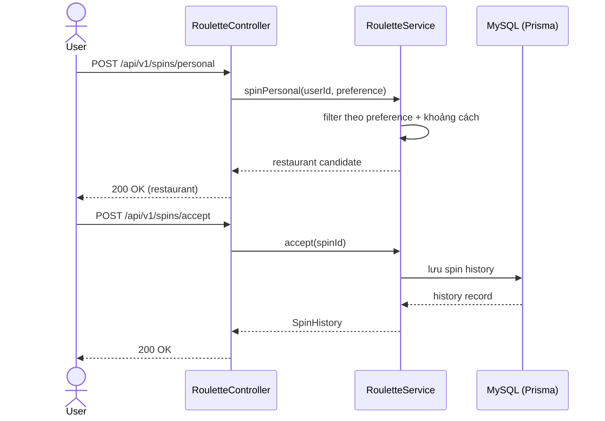
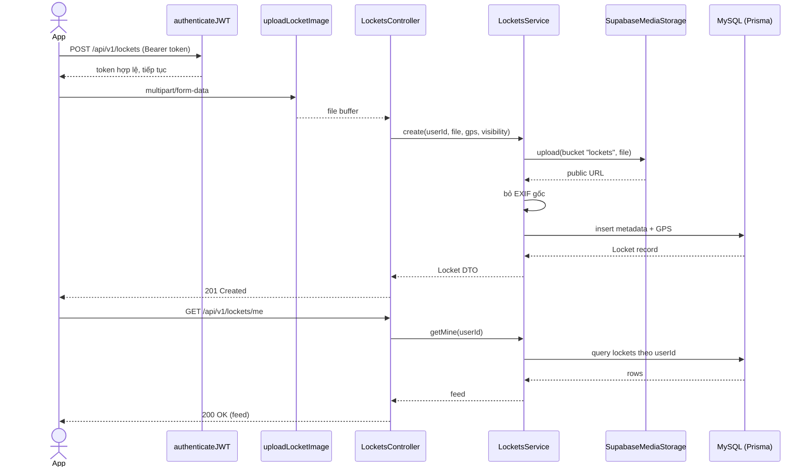
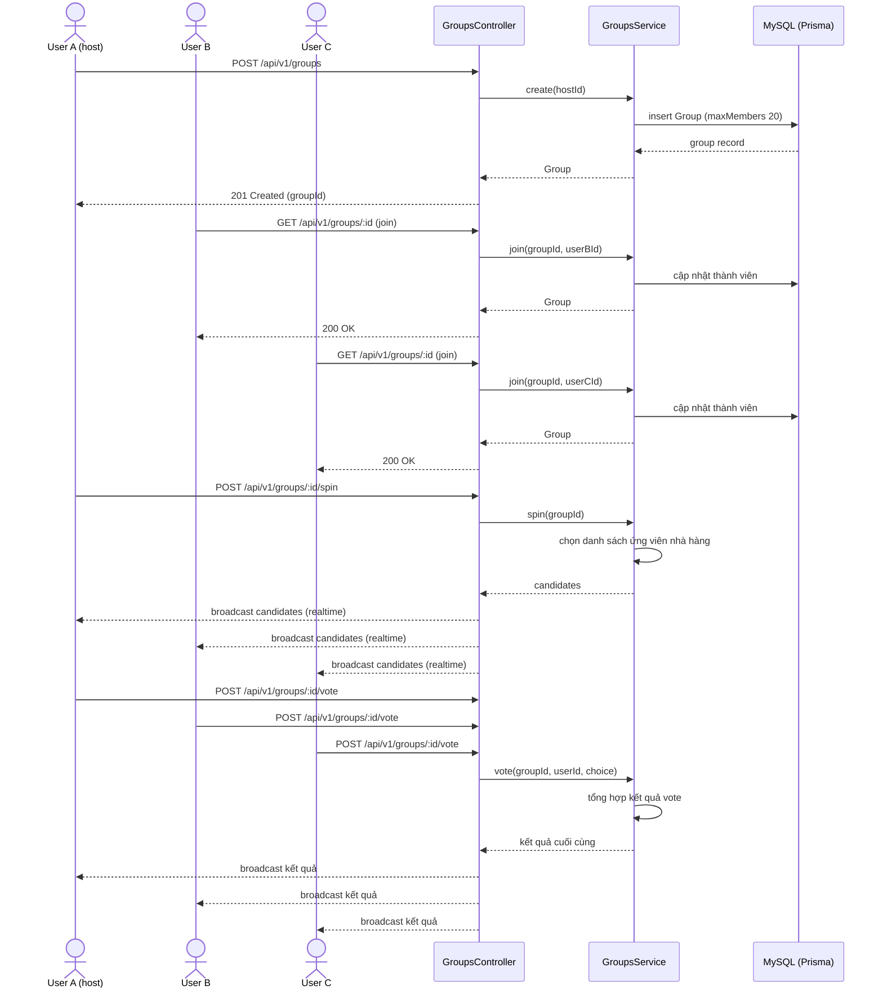

# Class Diagram & Sequence Diagram — Backend Architecture

## 1. Class Diagram

```mermaid
classDiagram
    %% ===== Auth Module =====
    class AuthController {
        <<middleware>>
        +register(req, res)
        +login(req, res)
        +google(req, res)
        +onboarding(req, res)
        +forgotPassword(req, res)
        +resetPassword(req, res)
        +refresh(req, res)
    }
    class AuthService {
        +register(dto) User
        +login(dto) TokenPair
        +loginWithGoogle(dto) TokenPair
        +completeOnboarding(userId, dto) User
        +forgotPassword(email) void
        +resetPassword(token, newPassword) void
        +refreshToken(token) TokenPair
    }
    class User {
        <<Prisma model>>
        +id: string
        +email: string
        +passwordHash: string
        +createdAt: DateTime
    }
    AuthController --> AuthService : uses
    AuthService --> User : reads/writes

    %% ===== Users Module =====
    class UsersController {
        <<middleware>>
        +getById(req, res)
        +updateMe(req, res)
    }
    class UserService {
        +findById(id) User
        +update(id, dto) User
    }
    UsersController --> UserService : uses
    UserService --> User : reads/writes

    %% ===== Profile Module =====
    class ProfileController {
        <<middleware>>
        +getProfile(req, res)
        +updateProfile(req, res)
    }
    class ProfileService {
        +getByUserId(userId) Profile
        +update(userId, dto) Profile
    }
    ProfileController --> ProfileService : uses
    ProfileService --> User : reads/writes

    %% ===== Friends Module =====
    class FriendsController {
        <<middleware>>
        +sendRequest(req, res)
        +accept(req, res)
        +reject(req, res)
        +remove(req, res)
    }
    class FriendsService {
        +sendRequest(fromId, toId) FriendShip
        +accept(requestId) FriendShip
        +reject(requestId) void
        +remove(userId, friendId) void
    }
    class FriendShip {
        <<Prisma model>>
        +id: string
        +userAId: string
        +userBId: string
        +status: string
    }
    FriendsController --> FriendsService : uses
    FriendsService --> FriendShip : reads/writes
    FriendShip o-- User : references

    %% ===== Lockets Module =====
    class LocketsController {
        <<middleware>>
        +create(req, res)
        +getFeed(req, res)
        +getMine(req, res)
        +getById(req, res)
        +update(req, res)
        +delete(req, res)
        +getMedia(req, res)
    }
    class LocketsService {
        +create(userId, file, gps, visibility) Locket
        +getFeed(userId) Locket[]
        +getMine(userId) Locket[]
        +getById(id) Locket
        +update(id, dto) Locket
        +delete(id) void
        +getMedia(id) MediaRef
    }
    class MediaStorage {
        <<interface>>
        +upload(bucket, file) string
        +delete(path) void
        +getUrl(path) string
    }
    class InMemoryMediaStorage {
        +upload(bucket, file) string
        +delete(path) void
        +getUrl(path) string
    }
    class SupabaseMediaStorage {
        +upload(bucket, file) string
        +delete(path) void
        +getUrl(path) string
    }
    class SupabaseStorageConfig {
        +url: string
        +serviceKey: string
        +bucket: string
    }
    class uploadLocketImage {
        <<middleware>>
        +multer parse multipart
    }
    class Locket {
        <<Prisma model>>
        +id: string
        +userId: string
        +mediaUrl: string
        +lat: float
        +lng: float
        +visibility: string
    }
    LocketsController --> LocketsService : uses
    LocketsController ..> uploadLocketImage : uses
    LocketsService o-- MediaStorage : depends on
    MediaStorage <|.. InMemoryMediaStorage : implements
    MediaStorage <|.. SupabaseMediaStorage : implements
    SupabaseMediaStorage --> SupabaseStorageConfig : uses
    LocketsService --> Locket : reads/writes

    %% ===== Restaurants Module =====
    class RestaurantsController {
        <<middleware>>
        +getAll(req, res)
        +getById(req, res)
        +search(req, res)
    }
    class RestaurantsService {
        +findAll(filter) Restaurant[]
        +findById(id) Restaurant
        +search(query) Restaurant[]
    }
    class Restaurant {
        <<Prisma model>>
        +id: string
        +name: string
        +lat: float
        +lng: float
        +category: string
        +status: string
    }
    RestaurantsController --> RestaurantsService : uses
    RestaurantsService --> Restaurant : reads/writes

    %% ===== Reviews Module =====
    class ReviewsController {
        <<middleware>>
        +create(req, res)
        +getByRestaurant(req, res)
    }
    class ReviewsService {
        +create(userId, restaurantId, dto) Review
        +getByRestaurant(restaurantId) Review[]
    }
    class Review {
        <<Prisma model>>
        +id: string
        +userId: string
        +restaurantId: string
        +rating: int
        +comment: string
    }
    ReviewsController --> ReviewsService : uses
    ReviewsService --> Review : reads/writes
    Review o-- Restaurant : references
    Review o-- User : references

    %% ===== Roulette (Spins) Module =====
    class RouletteController {
        <<middleware>>
        +spinPersonal(req, res)
        +accept(req, res)
        +reroll(req, res)
        +history(req, res)
    }
    class RouletteService {
        +spinPersonal(userId, preference) Restaurant
        +accept(spinId) SpinHistory
        +reroll(spinId) Restaurant
        +history(userId) SpinHistory[]
    }
    RouletteController --> RouletteService : uses
    RouletteService --> Restaurant : reads

    %% ===== Groups Module =====
    class GroupsController {
        <<middleware>>
        +create(req, res)
        +join(req, res)
        +spin(req, res)
        +vote(req, res)
    }
    class GroupsService {
        +create(hostId) Group
        +join(groupId, userId) Group
        +spin(groupId) Restaurant[]
        +vote(groupId, userId, choice) VoteResult
    }
    class Group {
        <<Prisma model>>
        +id: string
        +hostId: string
        +maxMembers: int
        +status: string
    }
    GroupsController --> GroupsService : uses
    GroupsService --> Group : reads/writes
    Group o-- User : members

    %% ===== Menu Module =====
    class MenuController {
        <<middleware>>
        +scan(req, res)
        +getByRestaurant(req, res)
    }
    class MenuService {
        +scan(image) MenuItem[]
        +getByRestaurant(restaurantId) MenuItem[]
    }
    class GeminiVisionService {
        +analyzeImage(image) MenuItem[]
    }
    class VoiceController {
        <<middleware>>
        +voicePick(req, res)
    }
    MenuController --> MenuService : uses
    MenuService --> GeminiVisionService : uses
    VoiceController --> MenuService : uses

    %% ===== Circles Module =====
    class CircleController {
        <<middleware>>
        +recommend(req, res)
    }
    CircleController --> RestaurantsService : uses

    %% ===== Partners Module =====
    class PartnerController {
        <<middleware>>
        +register(req, res)
        +analytics(req, res)
        +visitCheckin(req, res)
        +billing(req, res)
        +promoCodes(req, res)
        +corporate(req, res)
    }
    class PartnerService {
        +register(dto) Partner
        +getAnalytics(partnerId) Analytics
        +visitCheckin(partnerId, userId) Visit
        +billing(partnerId) Invoice[]
        +managePromoCodes(partnerId, dto) PromoCode
        +corporateAccount(dto) Partner
    }
    class Partner {
        <<Prisma model>>
        +id: string
        +restaurantId: string
        +status: string
    }
    PartnerController --> PartnerService : uses
    PartnerService --> Partner : reads/writes
    Partner o-- Restaurant : references

    %% ===== Places Module =====
    class GooglePlacesController {
        <<middleware>>
        +nearby(req, res)
        +seed(req, res)
    }
    GooglePlacesController --> RestaurantsService : uses

    %% ===== Steward Module =====
    class StewardController {
        <<middleware>>
        +approveRestaurant(req, res)
        +rejectRestaurant(req, res)
    }
    StewardController --> RestaurantsService : uses

    %% ===== Notifications Module =====
    class NotificationController {
        <<middleware>>
        +getAll(req, res)
        +markRead(req, res)
    }
    NotificationController --> User : reads
```

---

## 2. Sequence Diagram

### Flow A — Personal Spin

### Flow B — Locket Upload (prod, Supabase)

### Flow C — Group Spin (realtime, max 20)

